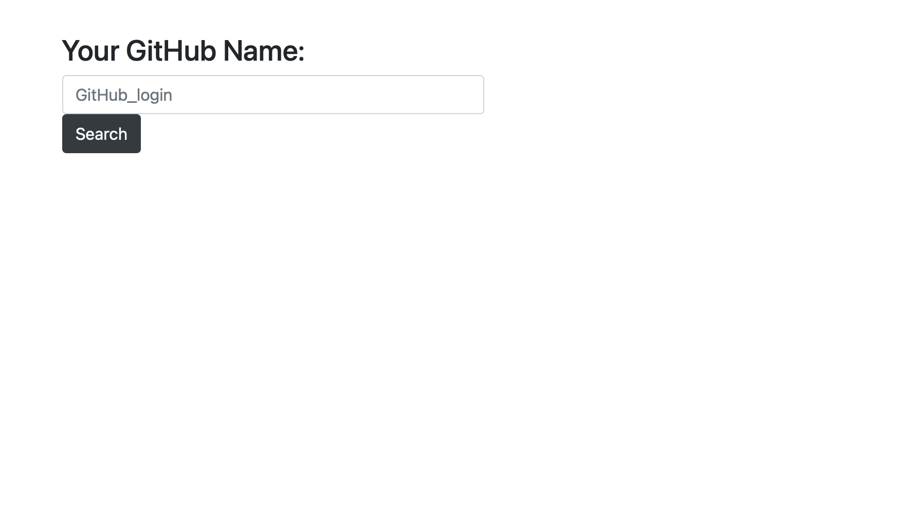
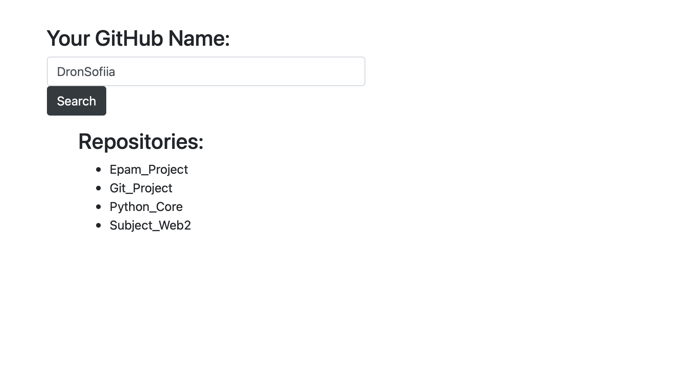

# Git_Project
>My project implements repository names by username.

All the necessary libraries can be downloaded from the file
requirement.txt:

```pip install -r requirement.txt```

You can complete the project with the command:
```python app.py```

You can also check the performance of function get_data() by running the test
```python test.py```

Input page:


Output page:


